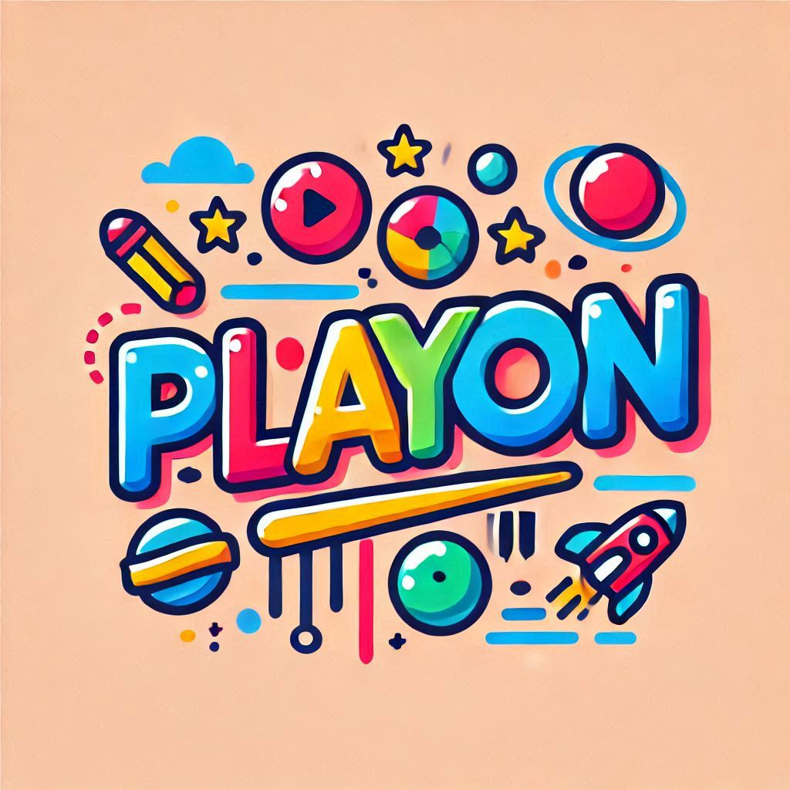

# PlayOn 


## 프로젝트 소개

**PlayOn**은 다양한 스포츠 종목에서 발생하는 부상 사례를 수집하고 분석하여, 부상의 원인과 예방 방법을 시각적으로 제공하는 웹 애플리케이션입니다. YouTube Data API를 활용하여 스포츠 경기 중 발생한 부상 영상을 수집하고, Flask와 MongoDB를 사용하여 데이터를 관리합니다. 누구나 쉽게 부상 정보를 확인하고 예방할 수 있도록 돕습니다.

## 주요 기능

- **부상 데이터 수집**: YouTube Data API를 사용하여 다양한 스포츠 종목의 부상 관련 영상을 수집하고 메타데이터를 저장
- **데이터 관리**: Flask와 MongoDB를 이용하여 부상 정보를 효율적으로 관리하고 CRUD(생성, 조회, 업데이트, 삭제) 기능 제공
- **데이터 분석 및 시각화**: 부상 발생 빈도, 부위별 분포, 원인 등을 그래프와 차트로 시각화
- **부상 예방 가이드**: 스트레칭, 보강 운동 등 실질적인 부상 예방 방법 제공

## 기술 스택

### 백엔드
- **Python**: 주요 프로그래밍 언어
- **Flask**: Python 기반의 경량 웹 프레임워크
- **Flask-PyMongo**: Flask와 MongoDB 연결을 위한 라이브러리

### 데이터베이스
- **MongoDB Atlas**: 클라우드 기반의 NoSQL 데이터베이스 서비스

### 기타 도구
- **YouTube Data API**: YouTube 영상의 메타데이터 수집
- **pandas**: 데이터 전처리 및 분석을 위한 Python 라이브러리
- **Chart.js**: 데이터 시각화를 위한 JavaScript 라이브러리

## 설치 및 실행 방법

### 1. 클론 및 환경 설정
```bash
git clone https://github.com/yourusername/playon.git
cd playon
python -m venv venv
source venv/bin/activate  # Windows에서는 `venv\Scripts\activate`
pip install -r requirements.txt
```

2. 환경 변수 설정
프로젝트 루트 디렉토리에 .env 파일을 생성하고, 다음과 같이 환경 변수를 설정합니다:
```bash
MONGO_URI=your_mongo_uri
YOUTUBE_API_KEY=your_youtube_api_key
```

3. 애플리케이션 실행

```bash
flask run
```

4. 웹 브라우저에서 접속
웹 브라우저를 열고 http://127.0.0.1:5000에 접속합니다.

- 디렉토리 구조
```markdown
playon/
├── ops/
│   ├── etl.py
│   └── factory.py
├── services/
│   ├── queries_service.py
│   ├── sheets_service.py
│   └── youtube_service.py
├── templates/
│   └── index.html
├── app.py
├── requirements.txt
└── README.md
```
다음은 내가 작성한 내용을 

README.md

 파일에 추가한 예시입니다.

```markdown
# PlayOn

## 프로젝트 소개

**PlayOn**은 다양한 스포츠 종목에서 발생하는 부상 사례를 수집하고 분석하여, 부상의 원인과 예방 방법을 시각적으로 제공하는 웹 애플리케이션입니다. YouTube Data API를 활용하여 스포츠 경기 중 발생한 부상 영상을 수집하고, Flask와 MongoDB를 사용하여 데이터를 관리합니다. 누구나 쉽게 부상 정보를 확인하고 예방할 수 있도록 돕습니다.

## 주요 기능

- **부상 데이터 수집**: YouTube Data API를 사용하여 다양한 스포츠 종목의 부상 관련 영상을 수집하고 메타데이터를 저장
- **데이터 관리**: Flask와 MongoDB를 이용하여 부상 정보를 효율적으로 관리하고 CRUD(생성, 조회, 업데이트, 삭제) 기능 제공
- **데이터 분석 및 시각화**: 부상 발생 빈도, 부위별 분포, 원인 등을 그래프와 차트로 시각화
- **부상 예방 가이드**: 스트레칭, 보강 운동 등 실질적인 부상 예방 방법 제공

## 기술 스택

### 백엔드
- **Python**: 주요 프로그래밍 언어
- **Flask**: Python 기반의 경량 웹 프레임워크
- **Flask-PyMongo**: Flask와 MongoDB 연결을 위한 라이브러리

### 데이터베이스
- **MongoDB Atlas**: 클라우드 기반의 NoSQL 데이터베이스 서비스

### 기타 도구
- **YouTube Data API**: YouTube 영상의 메타데이터 수집
- **pandas**: 데이터 전처리 및 분석을 위한 Python 라이브러리
- **Chart.js**: 데이터 시각화를 위한 JavaScript 라이브러리

## 설치 및 실행 방법

### 1. 클론 및 환경 설정
```bash
git clone https://github.com/yourusername/playon.git
cd playon
python -m venv venv
source venv/bin/activate  # Windows에서는 `venv\Scripts\activate`
pip install -r requirements.txt
```

### 2. 환경 변수 설정
프로젝트 루트 디렉토리에 `.env` 파일을 생성하고, 다음과 같이 환경 변수를 설정합니다:
```
MONGO_URI=your_mongo_uri
YOUTUBE_API_KEY=your_youtube_api_key
```

### 3. 애플리케이션 실행
```bash
flask run
```

### 4. 웹 브라우저에서 접속
웹 브라우저를 열고 `http://127.0.0.1:5000`에 접속합니다.

## 디렉토리 구조
```
playon/
├── ops/
│   ├── etl.py
│   └── factory.py
├── services/
│   ├── queries_service.py
│   ├── sheets_service.py
│   └── youtube_service.py
├── templates/
│   └── index.html
├── static/
│   ├── styles.css
├── app.py
├── requirements.txt
└── README.md
```

## 주요 파일 설명

### `app.py`
Flask 애플리케이션의 메인 파일로, 주요 라우트와 초기 설정을 포함합니다.
- `/`: 메인 대시보드 라우트. 스포츠 카테고리, 새로운 부상 데이터, 부상 데이터를 시각화하여 렌더링합니다.
- `/save`: POST 요청을 처리하여 각 스포츠별 데이터를 저장합니다.

### `services/sheets_service.py`
Google Sheets API를 사용하여 스포츠 카테고리와 부상 종류를 가져오는 함수들을 포함합니다.

### `services/youtube_service.py`
YouTube Data API를 사용하여 최신 부상 관련 영상을 가져오는 함수들을 포함합니다.

### `services/queries_service.py`
기본 쿼리를 생성하고 검색하는 함수들을 포함합니다.

### `ops/factory.py`
Flask 애플리케이션을 생성하고 MongoDB와 연결하는 기능을 포함합니다.

### `ops/etl.py`
데이터 추출, 변환, 적재(ETL) 작업을 수행하는 기능을 포함합니다.

### `templates/index.html`
메인 대시보드 페이지의 HTML 템플릿입니다. 스포츠 카테고리, 새로운 부상 데이터, 부상 데이터 시각화를 포함합니다. Chart.js를 사용하여 부상 데이터를 시각화합니다.